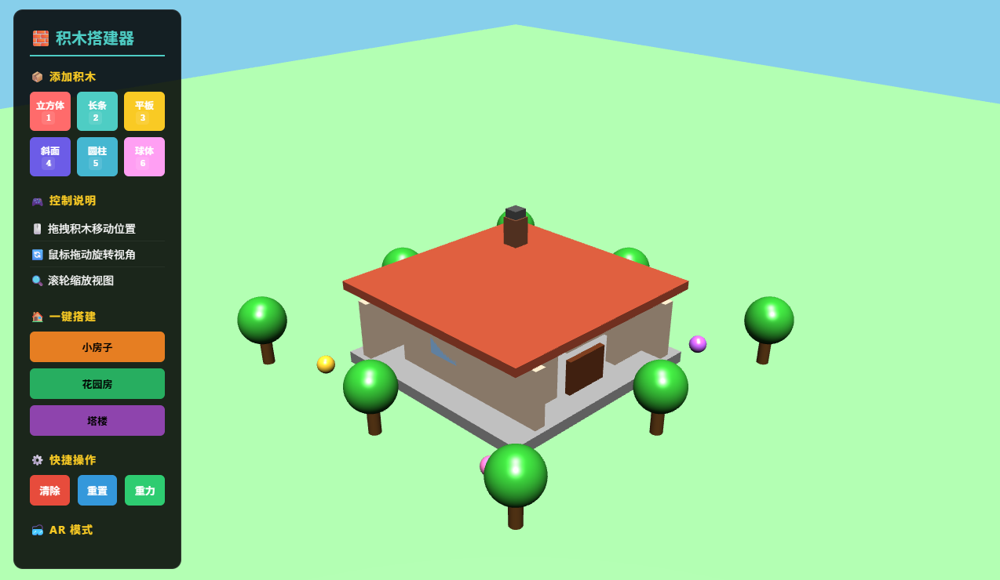

# 🧱 Block Builder - Three.js Web版

基于Three.js的3D积木搭建器，运行在Web浏览器中。

## 📋 技术栈

- **Three.js** - 3D渲染引擎
- **Vite** - 开发服务器和构建工具
- **TypeScript** - 类型安全的JavaScript

## 🚀 快速开始

### 安装依赖

```bash
npm install
```

### 开发模式

```bash
npm run dev
```

然后在浏览器中打开 `http://localhost:5173`

### 构建生产版本

```bash
npm run build
```

## 📁 项目结构

```
web-threejs/
├── src/
│   ├── index.ts          # 主入口文件
│   ├── blocks/           # 积木系统
│   ├── builders/         # 建筑构造器（房子、塔楼等）
│   ├── controls/         # 交互控制
│   ├── physics/          # 物理引擎
│   ├── components/       # 可复用组件
│   └── utils/            # 工具函数
├── index.html            # HTML入口
├── main.ts              # 应用初始化
├── vite.config.ts       # Vite配置
└── package.json
```

## 🎮 功能特性

- ✅ 3D积木创建和拖拽
- ✅ 物理碰撞检测
- ✅ 预设建筑（房子、塔楼、花园）
- ✅ 轨道控制器（鼠标交互）
- ✅ 实时阴影渲染

## 🌐 运行效果



## 📝 许可证

MIT
